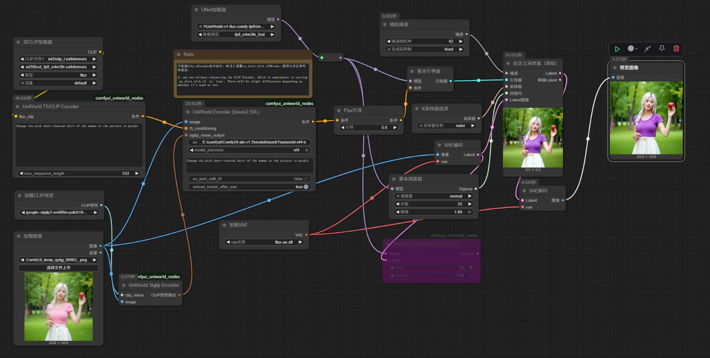

# ComfyUI-UniWorld-jd17
Unofficial ComfyUI implementation of the [UniWorld-V1](https://github.com/PKU-YuanGroup/UniWorld-V1) of image editting.

UniWorld的图像编辑部分功能在comfyui中的尝试实现。

## 介绍

工作流与效果如图。



图像编辑功能大概也许是实现了吧：）

**注意需要确保comfyui环境中transformers==4.50.0（至少我测试4.52.3会报错，更低版本不清楚）**

权重提取：你可以使用 [extract_uniworld_weights](assets/extract_uniworld_weights.py) 从 [UniWorld](https://huggingface.co/LanguageBind/UniWorld-V1) 模型中提取 Flux 模型权重和剩余权重。示例：

```python
python "E:\comfyui\UniWorld-V1\extract_uniworld_weights.py" "E:\models\diffusers\uniworld-32" "E:\comfyui\models\diffusers\uniworld-16"
```


提取出的 Flux 权重可直接使用 ComfyUI 的 UnetLoader 加载。
剩余权重则用于 UniWorld Encoder 节点进行文本编码（需要相应修改 config.json 文件）。
NF4 量化模型支持：特别感谢 [wikeeyang](https://huggingface.co/wikeeyang) 提供的 [UniWorld-V1-NF4](https://huggingface.co/wikeeyang/UniWorld-V1-NF4) 模型。

你可以使用[extract_uniworld_nf4_weights](assets/extract_uniworld_nf4_weights.py) 提取其中的 NF4 量化 Qwen2.5VL 权重。示例：

```python
python "E:\comfyui\UniWorld-V1\extract_uniworld_weights.py" "E:\models\diffusers\uniworld-v1-nf4" "E:\comfyui\models\diffusers\uniworld-v1-extracted"
```

这些权重同样用于 UniWorld Encoder 节点进行文本编码（需要相应修改 config.json 文件）。

## 下载
以下是部分预处理过的模型权重的下载链接：

来自 UniWorld-V1 的 Flux 权重：

[UniWorld-v1-flux-comfy-fp8](https://www.modelscope.cn/models/ahaha2024/UniWorld-v1-flux-comfy-fp8/)


[UniWorld-v1-flux-bf16](https://www.modelscope.cn/models/ahaha2024/UniWorld-v1-flux-bf16)

来自 UniWorld-V1 的 Qwen2.5VL 权重：

[UniWorld-v1-qwen2.5vl-nf4](https://www.modelscope.cn/models/ahaha2024/UniWorld-v1-qwen2.5vl-nf4/)

[UniWorld-v1-qwen2.5vl-bf16](https://www.modelscope.cn/models/ahaha2024/UniWorld-v1-qwen2.5vl-bf16)

你也可以选择自行下载官方模型，并使用上述提供的脚本进行处理。[config.json](assets/bf16/config.json) 是 bf16 版 UniWorld Encoder 模型的配置文件，[config.json](assets/nf4/config.json) 是 nf4 版 UniWorld Encoder 模型的配置文件。

## 补充说明

本人不擅长代码，本项目中的节点主要由 Gemini 协助编写，对比输出结果大概应该也许是实现了吧。如果您发现任何可以改进的地方，欢迎指出！
